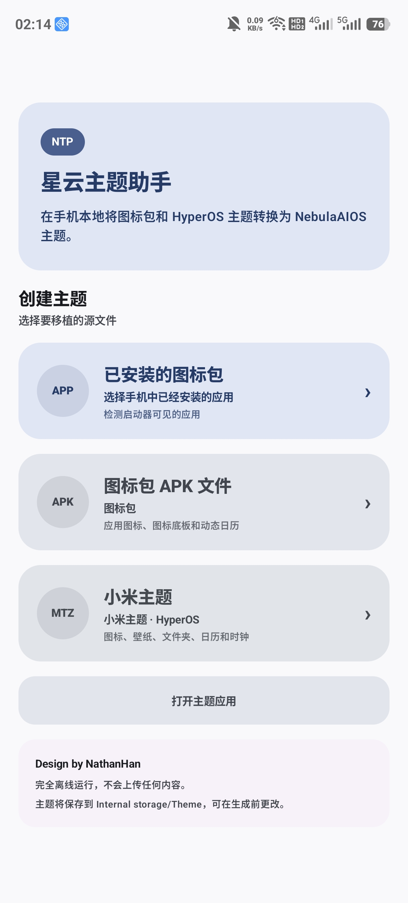
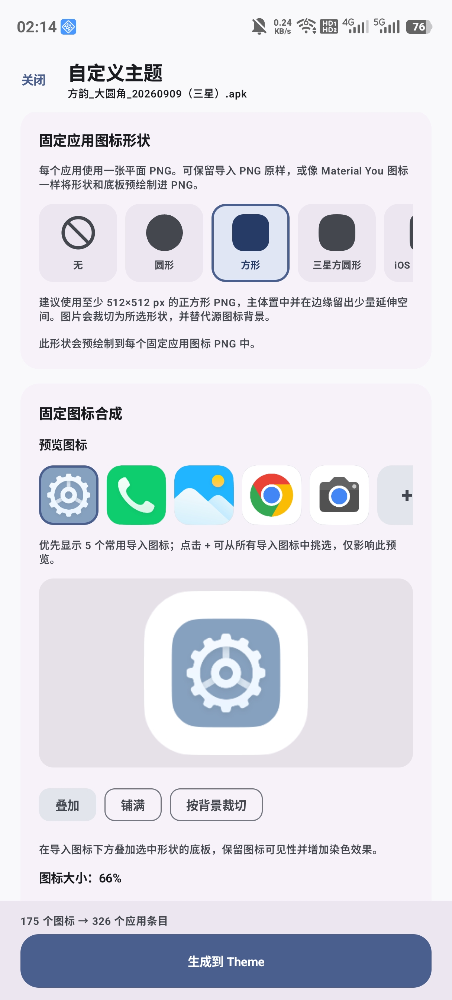
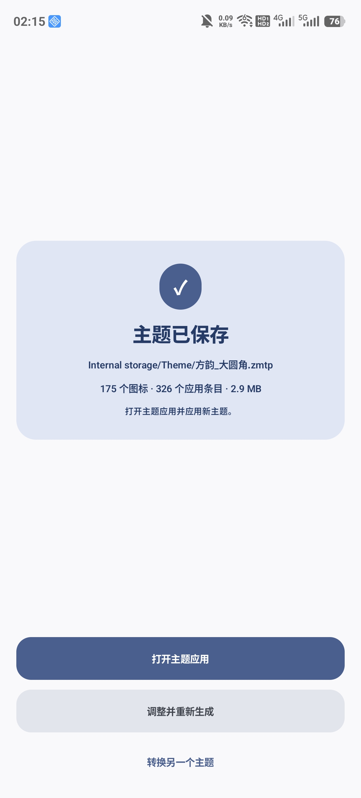

# Nebula Theme Porter

Nebula Theme Porter converts icon packs and MIUI/HyperOS themes into NebulaAIOS themes (`.zmtp`), entirely on your phone. It's built for ZTE and nubia phones running Mifavor OS / NebulaAIOS.

Everything runs offline. The app has no Internet permission, reads only the source file you pick, and writes only the theme it builds.

## What it can convert

- An **icon pack APK** (ADW/Nova-style, with an `appfilter.xml`) — either one already installed on your phone or an APK file.
- A **MIUI/HyperOS theme** (`.mtz`) — icons, wallpaper, folders, calendar and clock.

The result is a `.zmtp` file you apply from the phone's built-in **Themes** app, just like any other theme.

It can also **recolor a Xiaomi theme without porting it**: an `.mtz` goes in, a tinted `.mtz` comes out, for Xiaomi/HyperOS phones. See [Recoloring a Xiaomi theme](#recoloring-a-xiaomi-theme).

## Getting started

1. **Grant "All files access"** when the home screen asks. With it, a file you pick is read in place and the finished theme is saved straight into `Internal storage/Theme`. You can change the output folder from the system folder picker (it can't select the storage root or Download). Without the permission, the app copies the source first and asks where to save each result.
2. **Choose a source** on the home screen, under **Port a theme**:
   - **Installed icon pack** — pick from apps already on your phone that contain an `appfilter.xml`.
   - **Icon pack APK file** — pick any icon-pack APK from storage.
   - **Xiaomi theme** — pick a `.mtz` file.

   Under **Modify a theme**, **Xiaomi theme** instead recolors an `.mtz` and saves it as an `.mtz`; see [Recoloring a Xiaomi theme](#recoloring-a-xiaomi-theme).

## Customizing the theme

- **Theme info** — set the Chinese/English names, author and description shown in the Themes app, and the output file name.
- **Fixed app-icon shape** — pick one shape to bake into every app icon, or **None** to keep each imported icon's original artwork untouched. The gallery includes Circle, Square, Samsung Squircle, iOS Squircle, Slanted, Fan, Pentagon, Gem, Sunny, 6/9/12-sided Cookie, 4/8-leaf Clover, Soft Burst, Flower, Ghostish, Pixel Circle and Heart.
- **Composition**, once a shape is chosen:
  - **Overlay** — a tinted plate sits behind the icon, so the imported artwork stays fully visible on top.
  - **Cover** — the icon is cropped to completely fill the shape.
  - **Crop to background** — the icon keeps its imported size but is clipped to the shape's outline.
- **Live preview** — five common imported icons plus the calendar and clock, each rendered through the exact pipeline the build uses, so a shape, composition or tint change shows its effect across several different icons at once.
- **Icon size, transparency and background size** sliders fine-tune how the icon sits on its plate, under the collapsible **Icon & background size** heading.
- **Background tint and icon tint** — pick a color from the current wallpaper's palette, a neutral, or a custom color. Icon tint recolors the imported glyph from its own grayscale shading while keeping its transparent outline, with independent hue/saturation/brightness and strength controls, plus a **blend mode** that decides how that shading meets the color:
  - **Multiply** — the classic: white becomes the tint color, black stays black.
  - **Overlay** — punchier: darkens below mid-grey, lightens above it.
  - **Soft Light** — the same idea without Overlay's hard midpoint, for a subtler recolor.
  - **Lighten** — keeps whichever of the shading or the tint is brighter, which rescues artwork too dark to read once tinted.
- **Custom background image** — instead of a flat color, use your own square PNG (512×512 px or larger, subject centered with a little edge bleed) as the shape's plate.
- **Wallpaper** — use the source's own wallpaper if it has one, or the built-in gradient studio (three colors, Linear/Radial/Soft-blob mixing, blur, and one-tap recoloring/reshuffling).
- **Calendar & clock** — both automatically pick up the same shape, composition, icon/background size and tint as every other icon, and both sit in the live preview, so a treatment that doesn't suit them can be caught before building rather than after.
- **Options** — limit the theme to apps actually installed on your phone, generate a plain calendar/clock when the source has none, and generate a temporary icon (from the app's own launcher icon) for installed apps missing from the source, optionally keeping that app's own icon background instead of the theme's unified color.
- **Manual replacement** — override the suggested icon for any supported system app, or any other installed, launcher-visible app, from a grid of the source's own icons, shown with the exact shape and tint they'll export with.
- **Batch tone curve** — long-press any icon in that grid to start selecting more, then drag a curve over a live histogram of the selected icons to even out how light or dark they look once tinted (tap empty space to add a point, drag a point to move it, long-press a point to remove it). A **Normalize** button shifts each selected icon by its own amount so they land on the same average brightness in one step, instead of hand-tuning each one.

### Making a mixed pack look like one set

Icon packs are rarely internally consistent — some glyphs come in bright, some almost black, and a single tint color lands differently on each. Two controls fix that together:

- **Blend mode** sets the character of the recolor across the whole theme. Multiply is the safe default; Soft Light keeps more of the source's own shading; Lighten rescues packs whose artwork is too dark to read once tinted.
- **The tone curve** corrects the icons that still don't match. Select them in the manual-replacement grid, then drag the curve over their combined histogram, or tap **Normalize** to pull them all to the same average brightness in one step. Normalize shifts the curve you drew rather than replacing it, so the two can be used in either order.

Blend mode is the global look; the curve is the per-icon correction that makes everything land on it.

## Building and applying

Tap **Build into…**, then open the **Themes** app and apply it from there like any other theme.

## Recoloring a Xiaomi theme

The home screen has two halves. **Port a theme** turns an icon pack or a Xiaomi theme into a NebulaAIOS `.zmtp`. **Modify a theme** does something different: it takes a Xiaomi theme and hands back a Xiaomi theme, with its icons recolored.

Pick **Xiaomi theme** under Modify a theme, choose a tint, and save. The result is still an `.mtz`, applied from the Themes app on a Xiaomi/HyperOS phone.

- **Only the icons change.** Every other component, the theme's own previews, its name, its author and its wallpapers are written back exactly as they were found, each entry with the compression it arrived with. The theme's own preview pictures aren't recolored, so the Themes app still shows the original colors there.
- **The tint is the same one the port flow uses** — the same colors, strength and blend modes — so a theme looks the same recolored as it would ported. Leaving the shape as **None** keeps every icon's own artwork, outline and pixel size, and changes only its colors; choosing a shape bakes that outline in instead.
- **Every app on your phone is listed**, in one grid under the tint controls — no split between system and user apps — each showing the icon it will actually end up with. A dot marks the apps the theme has nothing for, so you can see at a glance how much of your home screen it really covers.
- **Apps the theme skips can be filled in.** Xiaomi improvises an icon for those at runtime from the app's own icon, which means it stays in its original colors while everything around it turns one hue. Switch on **Add icons for apps the theme skips** and the app draws one instead, using the theme's own plate and mask, and writes it into the theme.
- **Only apps installed on this phone** leaves out icons for everything else. It makes the file much smaller, but also makes it useless to anyone whose apps differ from yours — leave it off for a theme you intend to share.

## Coming back to a theme

Building a theme also saves everything you decided about it, as a card in the **Saved tweaks** gallery on the home screen: the names, the shape and composition, the tint and blend mode, every per-icon curve and manual assignment, the wallpaper choice and the output name. **Save tweaks** on the configure screen parks a set you haven't built yet.

Tap a card to carry on editing it; long-press for **Edit**, **Build** and **Remove**.

The icon pack or `.mtz` itself is not copied into the saved set — it runs to tens of megabytes, so the set points at the file instead. If you later move, delete or uninstall it, the app says so and asks you to import it again; the tweaks are still there to carry on from. Removing a saved set leaves the source and any theme already built from it alone.

## Good to know

- **A rebuilt theme with the same file name may still show its old preview picture in the Themes app.** The Themes app appears to cache preview thumbnails by theme name rather than by content, so overwriting a `.zmtp` under the same name doesn't always refresh what it displays. If a freshly rebuilt theme looks unchanged in the Themes app's preview, give the output a new file name, or clear the Themes app's storage/cache from Android's app settings.
- The app never asks the system to switch icon shape live — every fixed-shape icon is pre-rendered into the theme itself, so there's no need for root access.

## Docs for developers

The theme file format this app targets is documented in [docs/NEBULA_THEME_FORMAT.md](docs/NEBULA_THEME_FORMAT.md), reverse-engineered from ZTE/nubia's stock themes.
